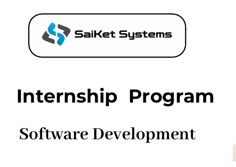
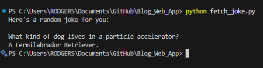
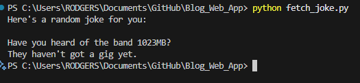
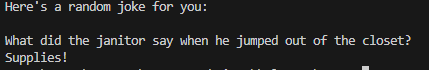

# simple-api-client



This repository documents my internship project at Saiket Systems. The first image above showcases the internship program offered by Saiket Systems.

To set up the project, install the required dependencies using:

```bash
pip install -r requirements.txt
```

Below are examples demonstrating the functionality of the program:

1. 
2. 
3. 
